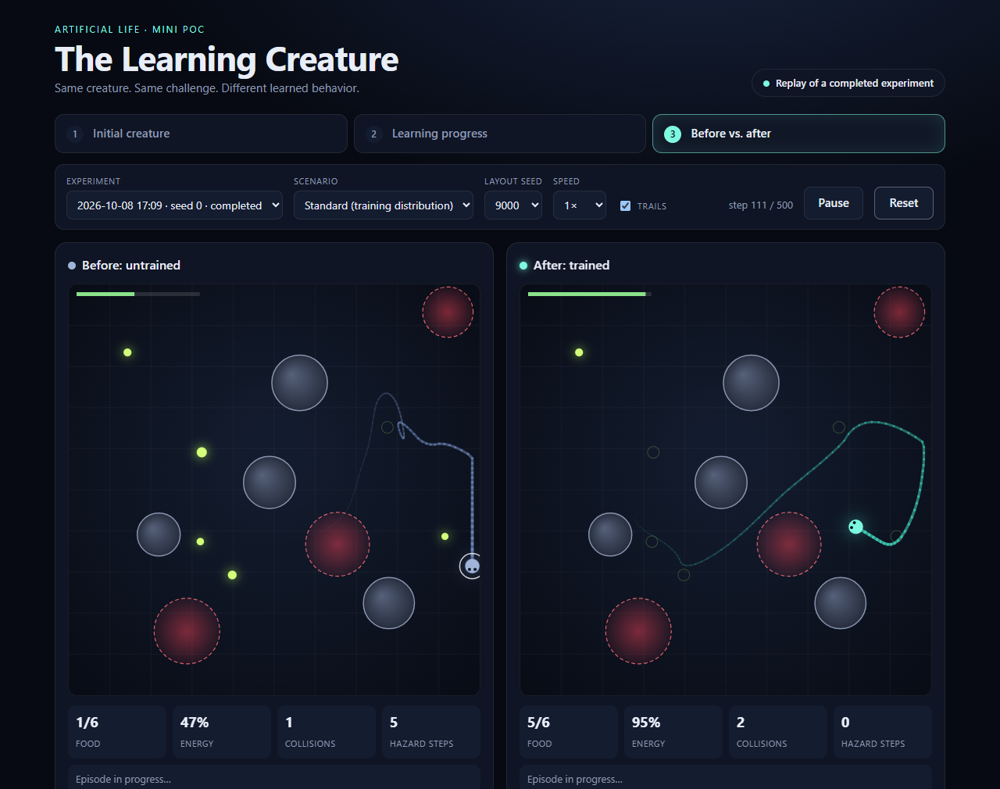
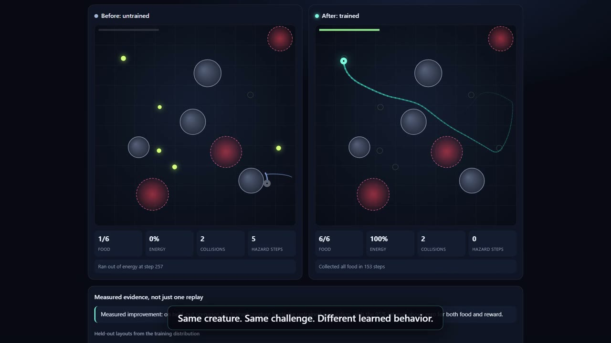
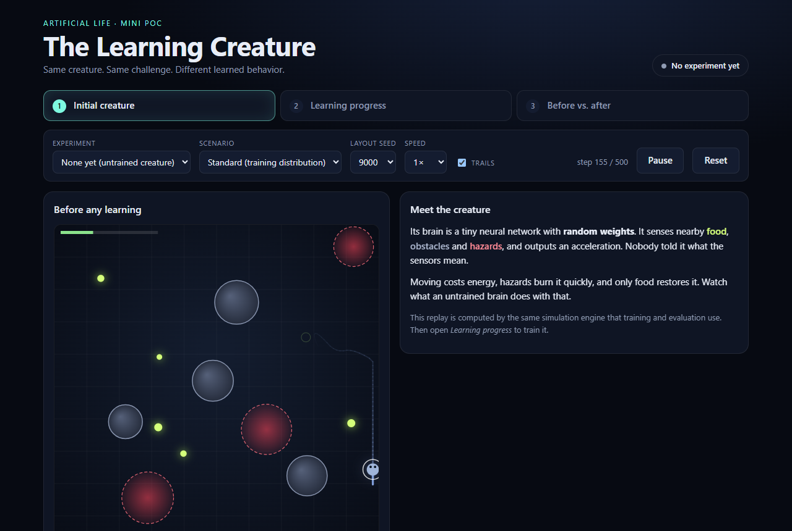
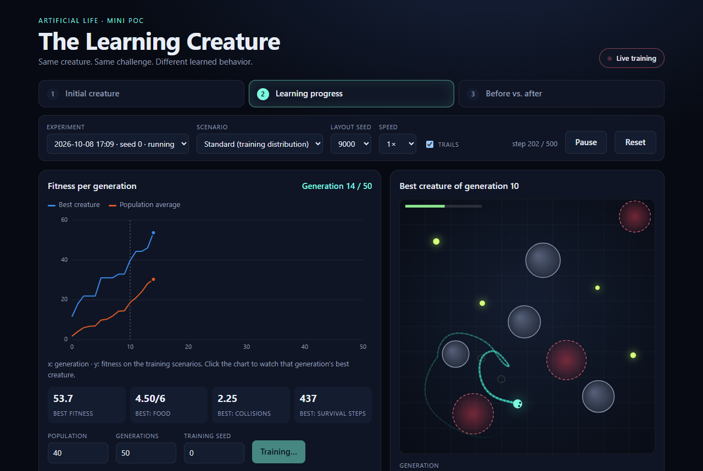
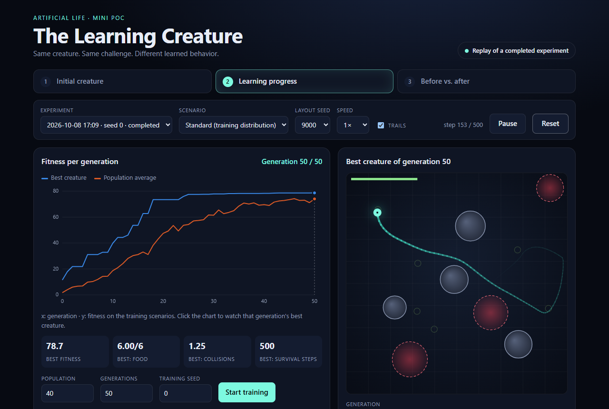
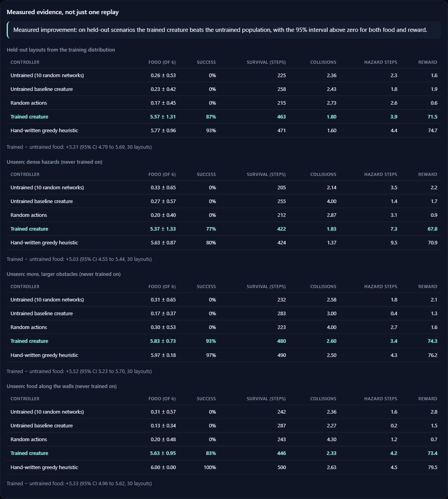
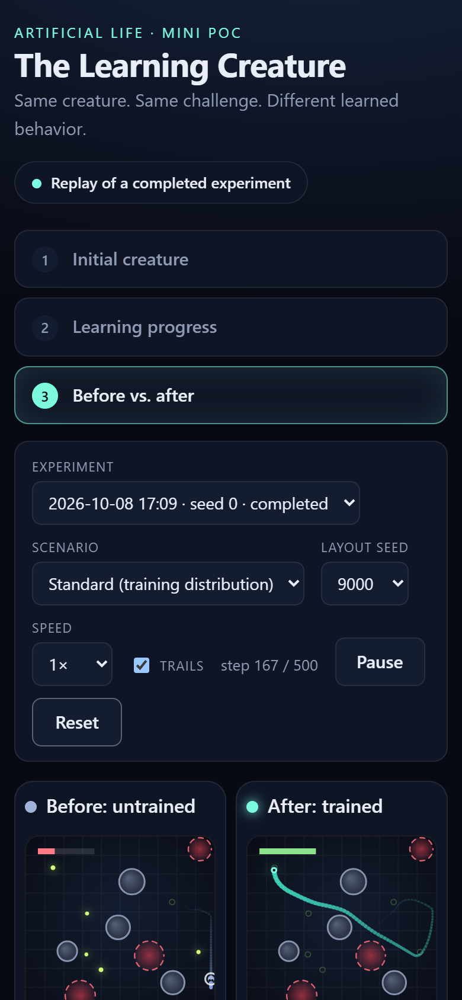
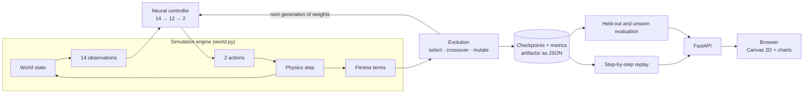

# Artificial Life — The Learning Creature

**Same creature. Same challenge. Different learned behavior.**

A small, fully local experiment: a digital creature starts with a random brain,
and a genetic algorithm improves that brain over 50 generations until the
creature reliably finds food in worlds it has never seen. Everything you see in
the browser is a replay of a real simulation, and every number below was measured.



## 1. What is this?

The creature lives in a square world with six pieces of food, round obstacles
that block it, and red hazard zones that drain its energy. It has a small
energy budget that runs out unless it eats, and 500 time steps per episode.

It senses 14 numbers (its velocity, the direction and distance of the nearest
food, the nearest obstacle and hazard, its position, its energy) and outputs two:
horizontal and vertical acceleration. A tiny neural network (206 weights)
connects the two. Nobody writes the rule for turning senses into movement —
that is the part the creature has to learn.

## 2. Why build it?

Most of what makes modern AI interesting is behavior that was *found by
optimization* rather than written by a programmer. That idea is easy to state
and hard to see. This project makes it visible at the smallest scale that is
still honest: one creature, one world, one learning loop, and a fair
measurement of whether anything was actually learned.

## 3. How does it work?

**Observe → Act → Receive feedback → Improve → Repeat.**

1. **Observe** — the creature reads its 14 sensor values.
2. **Act** — its network turns them into an acceleration.
3. **Receive feedback** — at the end of an episode the world scores it: food
   eaten, progress toward food, survival, minus collisions, hazard time and effort.
4. **Improve** — 40 creatures are scored on the same 8 training layouts. The
   best survive, and the next generation is built from them by crossover and
   small random mutations.
5. **Repeat** — for 50 generations.

This is a genetic algorithm over the weights of a fixed network. It is
neuroevolution, but it is **not NEAT**: the network's shape never changes.

## 4. The experiment

- **Training:** 8 layouts (seeds 100–107), population 40, 50 generations, CPU only,
  about 40 seconds.
- **Held-out test:** 30 layouts (seeds 9000–9029) that training never touches.
  The code refuses a training configuration that uses an evaluation seed.
- **Unseen worlds:** 30 more layouts for each of three variations never trained
  on — twice the hazards, more and larger obstacles, food pushed to the walls.
- **Fair comparison:** every controller faces the identical layouts under the
  identical rules, in the one simulation engine used for training, evaluation
  and replay.
- **Reference points:** untrained random networks, purely random actions, and a
  one-line hand-written heuristic ("accelerate straight at the nearest food").

## 5. Results

Reference run (training seed 0), 30 held-out layouts, food collected out of 6:

| Controller | Food (of 6) | All food collected | Hazard steps |
|---|---|---|---|
| Random actions | 0.17 | 0% | 2.6 |
| Untrained (10 random networks) | 0.26 | 0% | 2.3 |
| **Trained creature** | **5.57** | **87%** | 3.9 |
| Hand-written greedy heuristic | 5.77 | 93% | 4.4 |

- **It learned to find food.** Trained minus untrained: **+5.31 food** per
  episode (95% CI 4.79 to 5.69). Five independent training runs all showed it.
- **It carries over to unseen worlds.** 5.37 / 5.83 / 5.63 food on the dense-hazard,
  more-obstacle and edge-food variants in the reference run — though this varies
  a lot between training runs (dense-hazard success ranges from 37% to 83%).
- **It did not beat the simple heuristic.** Trained vs. greedy: −0.20 food
  (CI −0.83 to 0.40), not distinguishable; on the edge-food variant the trained
  creature is measurably *worse* (−0.37, CI −0.73 to −0.07).
- **It did not demonstrably learn to avoid hazards.** The central question asked
  about food *and* hazards; only the food half is supported by the evidence.
- **It still fails sometimes.** On one held-out layout (seed 9008) the trained
  creature collects nothing.

Full tables, the tuning history and what was and was not proven:
[docs/experimental-results.md](docs/experimental-results.md).

## 6. Visual demonstration

**Demo video (77 seconds)** — the real application, start to finish: the
untrained creature, live training, before vs. after, the measurements and the
limits. Click the preview to open it.

[](docs/media/learning-creature-demo.mp4)

Captions only, no narration. The training segment is shown as a labelled
time-lapse. How it was made: [docs/media/README.md](docs/media/README.md).

All screenshots below were captured from the running application by
`frontend/e2e/screenshots.spec.ts`.

**The untrained creature** — a random network wanders and starves.



**Learning in progress** — live fitness chart and the best creature of each generation.



**Training complete** — scrub through generations to watch the behavior change.



**Measured evidence** — the tables behind the claim, shown in the app next to the replay.





## 7. Architecture flow



The browser only draws trajectories computed by the backend; it never simulates
anything itself. More detail: [docs/system-design.md](docs/system-design.md).

## 8. Run locally

**Docker (recommended)**

```bash
docker compose up --build
```

Open <http://localhost:8080>. Go to *Learning progress*, press **Start training**,
then open *Before vs. after*. Runs and checkpoints persist in `./artifacts`.
Stop with `docker compose down`.

**Native** (Python 3.12, Node 22+)

```bash
cd frontend && npm install && npm run build
cd ../backend && pip install -r requirements.txt
python -m uvicorn creature.main:app --port 8080
```

**Without the browser**

```bash
cd backend
python -m creature.cli train --seed 0
python -m creature.cli replicates --seeds 0 1 2 3 4
```

**Tests** — see [docs/testing.md](docs/testing.md).

## 9. Research foundation

| Reference | What this project takes from it |
|---|---|
| Sutton & Barto, [*Reinforcement Learning: An Introduction*](https://incompleteideas.net/book/the-book-2nd.html) (2nd ed.) | The agent–environment loop, policies, reward design, and judging a policy by evaluation rather than by training score. |
| Stanley & Miikkulainen, [*Evolving Neural Networks through Augmenting Topologies*](https://doi.org/10.1162/106365602320169811) (2002) | The idea of evolving neural network controllers with a population, fitness and mutation. **Not** the NEAT algorithm itself. |
| Farama Foundation, [Gymnasium](https://gymnasium.farama.org/) | The environment contract: reset, step, episode termination, seeded reproducibility. The library is not used. |

Details and boundaries: [docs/research-foundation.md](docs/research-foundation.md).

## 10. Limitations and next steps

- The learned behavior matches, but does not beat, a one-line heuristic. The
  creature is handed the direction of the nearest food, so the task is largely
  "learn to follow that signal".
- Hazard avoidance is not demonstrated.
- One training run can generalize noticeably better or worse than another.
- This is a proof of concept: one background training job, JSON files, no
  authentication, local use only.

Natural next steps would be a world where the greedy route fails (so avoidance
has to be learned), removing the food-direction sensor in favor of raw range
sensing, and more training seeds for tighter estimates. See
[docs/limitations.md](docs/limitations.md).

## Further reading

- [docs/research-foundation.md](docs/research-foundation.md)
- [docs/system-design.md](docs/system-design.md)
- [docs/learning-method.md](docs/learning-method.md)
- [docs/experimental-results.md](docs/experimental-results.md)
- [docs/testing.md](docs/testing.md)
- [docs/limitations.md](docs/limitations.md)
