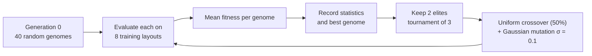

# Learning method

The creature learns by **neuroevolution with a fixed topology**: a genetic
algorithm searches the weights of a small neural network. No gradients, no
backpropagation, no deep-learning framework — only NumPy.

This is not NEAT. The network's structure never changes and there is no speciation.

## Why this method

- It maps directly onto a generation-by-generation story that can be shown.
- It needs only an episode-level score, so the reward does not have to be
  differentiable or dense.
- A 206-parameter search trains in well under a minute on a CPU.

The brief allowed tabular Q-learning as an alternative. It is a poor fit here:
the observations and actions are continuous and would need coarse discretization.

## The controller

A multilayer perceptron: 14 inputs → 12 hidden units (tanh) → 2 outputs (tanh).
That is 14×12 + 12 + 12×2 + 2 = **206 parameters**, stored as one flat vector
(the genome).

## The loop

1. **Initialize.** 40 genomes drawn from a normal distribution (σ = 0.5).
   Candidate 0 of this population is saved as the *untrained baseline*.
2. **Evaluate.** Every genome runs one full episode on each of the 8 training
   layouts (seeds 100–107). Its fitness is the mean reward.
3. **Record.** Best and mean fitness, food, collisions, survival, and the best
   genome of the generation are written to disk.
4. **Select.** The top 2 genomes are copied unchanged (elitism). Each remaining
   child's parent is the fittest of 3 randomly drawn candidates.
5. **Vary.** With probability 0.5 the child takes each weight from a second
   parent with probability 0.5. Gaussian noise (σ = 0.1) is then added to every weight.
6. **Repeat** for 50 generations. Generation 0 is the untouched random population.

The final controller is the best genome of the last generation **by training
fitness**. Held-out results play no part in selecting it.

Default settings (`TrainConfig`): population 40, generations 50, elite 2,
tournament 3, crossover rate 0.5, mutation σ 0.1, initial σ 0.5, seed 0.

## Fitness

Fitness is the sum of seven terms, each computed from simulation outcomes and
each reported separately in a replay.

| Term | Weight | Measured as |
|---|---|---|
| Food | +10 | per piece eaten |
| Progress | +5 | net distance closed toward the nearest food |
| Completion | +5 | if all food eaten, scaled 1–2× by how early |
| Survival | +2 | fraction of the episode survived |
| Collision | −0.5 | per new wall or obstacle contact |
| Hazard | −0.2 | per step inside a hazard |
| Effort | −1 | mean squared action over the episode |

Design notes:

- **Food dominates.** A full episode is worth at least 60 from food alone;
  everything else is shaping.
- **Progress cannot be farmed.** It is the *net* approach to the food that was
  nearest before the step, so moving toward and away cancels out. A test
  (`test_progress_cannot_be_farmed_by_oscillating`) covers this.
- **Progress is shaping, and it matters.** It rewards closing distance to food,
  which the creature can sense directly. It does not encode a route — obstacles
  and hazards are not accounted for in it — but it does make "move toward food"
  the easy thing to discover. See [limitations.md](limitations.md).
- **A collision is counted once per contact**, not once per step of contact.

## What counts as "learned"

Training fitness is not evidence of learning. With elitism on a fixed set of
training layouts, best fitness can never go down, so a rising curve is
guaranteed by construction. The evidence is the held-out evaluation described
in [experimental-results.md](experimental-results.md), and the verdict rule:

> `improved` only if the bootstrap 95% confidence interval of *trained minus
> untrained population* is above zero for **both** food and reward on the
> held-out standard layouts. Otherwise `no_clear_evidence` or `regressed`.

## Reproducibility

- A layout is fully determined by `(seed, variant)`.
- A training run is fully determined by `TrainConfig`, including its `seed`.
- Network inference uses explicit sums rather than BLAS so that results do not
  depend on batch size.
- Re-running `python -m creature.cli train --seed 0` reproduces the reference
  numbers. Re-evaluating the stored reference run after a container restart
  gave identical results.
