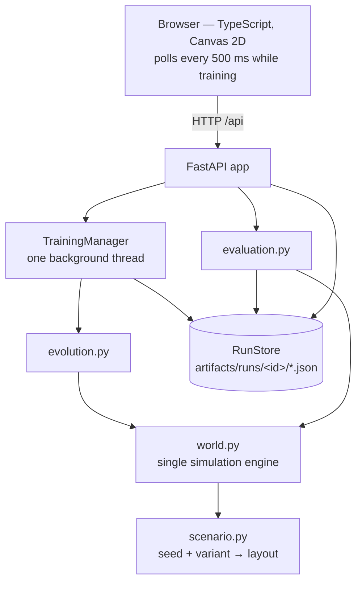

# System design

One Python process serves the API and the built frontend. There is no database,
queue or second service.

## Backend modules (`backend/creature/`)

| Module | Responsibility |
|---|---|
| `config.py` | Frozen world and reward constants; validated `TrainConfig`; the seed sets. |
| `scenario.py` | Deterministic layout generation for the four variants. |
| `world.py` | The only simulation engine: sensing, physics, energy, reward terms. Batched with NumPy. |
| `policy.py` | The neural controller, the greedy heuristic, the random-action policy. |
| `evolution.py` | The genetic algorithm and the training loop. |
| `evaluation.py` | Held-out and unseen evaluation, bootstrap intervals, verdict, replay. |
| `storage.py` | JSON run store with atomic, lock-protected writes. |
| `jobs.py` | Background training job; checkpoints after every generation. |
| `api.py`, `main.py` | HTTP API and static hosting. |
| `cli.py` | `train` and `replicates` commands. |

## The world

A unit square. One step is one tick; an episode lasts at most 500 steps.

- **Creature:** radius 0.018, acceleration up to 0.003 per step, speed capped at
  0.02, velocity damped by 0.93 each step.
- **Food:** 6 pieces. Eating one restores 0.3 energy (capped at 1.0).
- **Obstacles:** solid circles. The creature is pushed out and slides along them.
- **Hazards:** circles the creature can enter; each step inside drains 0.08 energy.
- **Walls:** the creature is clamped inside and its velocity into the wall is zeroed.
- **Energy:** starts at 1.0; drains 0.003 per step, plus up to 0.002 for thrust,
  plus 0.02 for each new collision. At zero the creature dies.
- **Episode ends** when all food is eaten (success), energy reaches zero (death),
  or step 500 is reached.

Without eating, base drain alone ends an episode after about 330 steps, so
standing still is not a viable strategy.

### Scenario variants

| Variant | Obstacles | Hazards | Food placement | Used for |
|---|---|---|---|---|
| `standard` | 4 (r 0.045–0.075) | 3 | anywhere | training and held-out test |
| `dense_hazards` | 4 | 6 | anywhere | unseen check |
| `more_obstacles` | 7 (r 0.055–0.085) | 3 | anywhere | unseen check |
| `edge_food` | 4 | 3 | within a band near a wall | unseen check |

Hazard radius is 0.06–0.09 in all variants. Placement rejects overlapping
elements and food that sits inside an obstacle or hazard.

## Observations and actions

14 normalized observations:

| Index | Meaning |
|---|---|
| 0–1 | Velocity ÷ max speed |
| 2–3 | Unit direction to the nearest remaining food |
| 4 | Distance to that food (clipped to 1) |
| 5–6 | Unit direction to the nearest obstacle (zero beyond sense range 0.3) |
| 7 | Obstacle proximity, 0–1 |
| 8–9 | Unit direction to the nearest hazard (zero beyond sense range) |
| 10 | Hazard proximity, 0–1 (1 = inside) |
| 11–12 | Position mapped to −1…1 |
| 13 | Remaining energy, 0–1 |

2 actions in −1…1: horizontal and vertical acceleration. Actions are clipped by
the engine.

The controller is never given target coordinates, the layout, or anything
outside this vector.

## HTTP API

| Method and path | Purpose |
|---|---|
| `GET /api/health` | Liveness (used by the Docker healthcheck). |
| `GET /api/config` | Default training settings, variants, evaluation seeds. |
| `POST /api/training` | Start a run. Returns 409 if one is already running. |
| `GET /api/training/status` | Whether a job is running, and its id. |
| `GET /api/runs` | List stored runs. |
| `GET /api/runs/{id}` | Run state, per-generation metrics, evaluation. |
| `POST /api/runs/{id}/evaluate` | Re-run the evaluation protocol for a completed run. |
| `POST /api/replay` | Simulate up to three controllers on one layout and return every step. |

Inputs are validated with Pydantic (unknown fields rejected, numeric bounds,
run-id pattern). Unhandled errors return a generic `internal error`; file paths
are not exposed. The training budget is capped at 200,000 episodes per job.

## Storage

Each run is a directory `artifacts/runs/<id>/` with four JSON files:
`run.json` (state and configuration), `metrics.json` (per-generation
statistics), `checkpoints.json` (baseline genome, best genome of every
generation, final best) and `evaluation.json`. Files are written to a temporary
name and renamed; reads and writes share a lock. Runs still marked `running`
when the process starts are relabelled `interrupted`.

`artifacts/` is gitignored. The files exported for the documentation live in
[`results/`](results/).

## Frontend (`frontend/src/`)

Vanilla TypeScript built with Vite; no UI framework and no charting library.

| File | Responsibility |
|---|---|
| `app.ts` | The three views, controls, polling. |
| `render.ts` | Canvas drawing of the world, creature, trails. |
| `chart.ts` | The fitness line chart. |
| `logic.ts` | Pure helpers (phase labels, chart mapping, formatting). |
| `api.ts`, `types.ts` | Typed API client. |

The frontend only plays back trajectories returned by `/api/replay`. In the
*Before vs. after* view both panes use the same layout and the same step index,
so the clocks are synchronized by construction. The status pill distinguishes
live training from the replay of a completed experiment.

## Deployment

`Dockerfile` is a two-stage build (Node builds the frontend, Python serves it)
running as a non-root user with a healthcheck. `docker-compose.yml` binds
`127.0.0.1:8080` only, mounts `./artifacts` at `/data`, and limits the
container to 2 CPUs.
